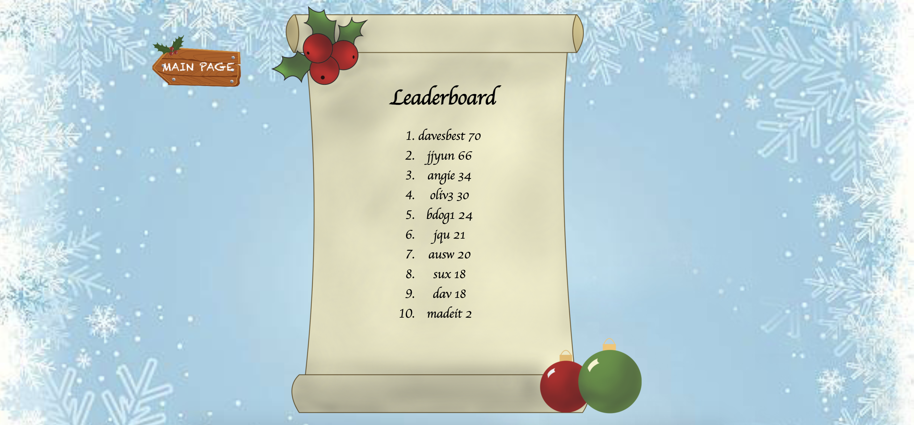

# FloppySanta
Park Plaza Pals' final project :) 

Testing Instructions: 
1. Open terminal and run: "chmod +x install.sh" and "chmod +x run.sh"
2. Run: "./install.sh"
4. In a seperate terminal window, run: "./run.sh"
5. Open localhost:8000 in a browser to play the game!

<h4>Start Screen<h4/>

<h4>How To Play<h4/>

<h4>Game Screen<h4/>

<h4>Christmas Skin Market<h4/>

<h4>Skin Inventory<h4/>

<h4>Leaderboard<h4/>

